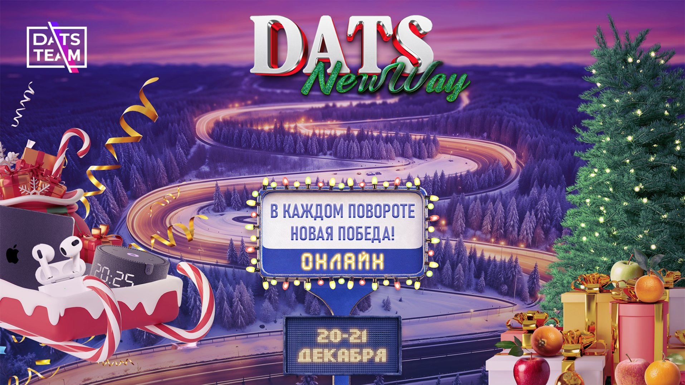
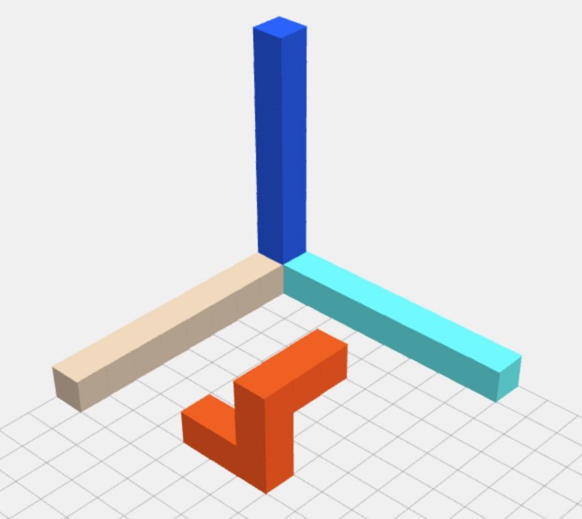
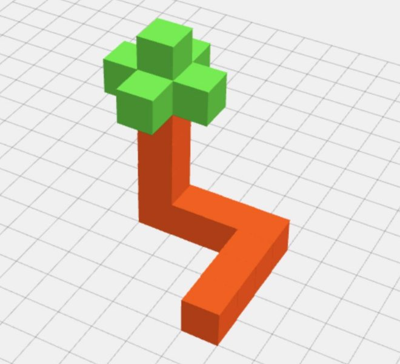
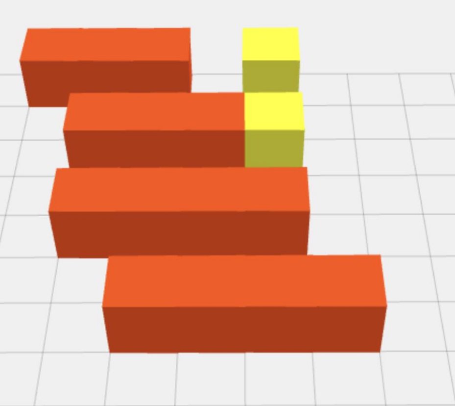
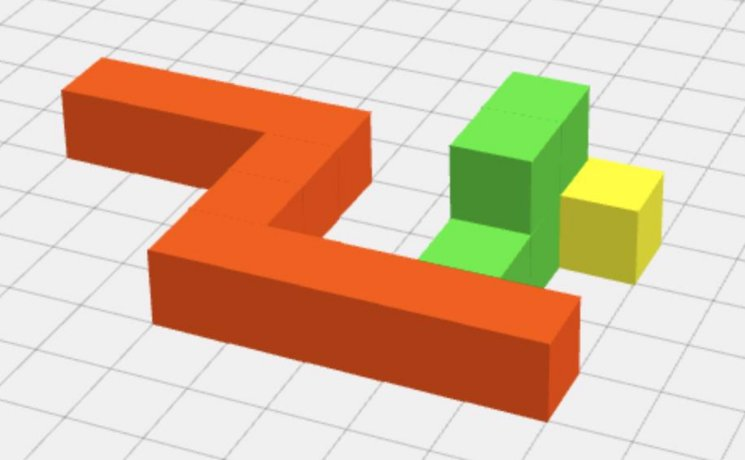

Геймтон DatsNewWay

Сервера

Есть два независимых сервера. Один – тестовый – будет работать все дни геймтона, и один – основной, на котором будут проходить финальные раунды.

1) [https://games-test.datsteam.dev/play/snake3d](https://www.google.com/url?q=https://games-test.datsteam.dev/play/snake3d&sa=D&source=editors&ust=1734710028333256&usg=AOvVaw13E-GH8NbW7jgTFuj-5Sd2)
1) [https://games.datsteam.dev/play/snake3d](https://www.google.com/url?q=https://games.datsteam.dev/play/snake3d&sa=D&source=editors&ust=1734710028333427&usg=AOvVaw0kHmjIbTEEMQU82L-AvPWV) 

Раунды

Игра проходит в несколько раундов. Расписание раундов можно получить по соответствующему API.

Внимание

Администраторы оставляют за собой право приостановить действие токена игрока если появилось подозрение в следующем:

- игрок нарочно поддается другим
- игрок пытается навредить игровому серверу
- игрок раскрыл свой токен другим игрокам
- мультиаккаунт
- игрок не соблюдает кодекс чата

Токен может быть восстановлен если породившая его ситуация была решена.

Карта

Представляет из себя трёхмерное пространство XYZ. Размеры по каждой оси будут содержаться в ответе API. Карта начинается с координаты [0 0 0]. Игроки не могут попасть за предел размера карты или в отрицательные координаты.

На рисунке разными цветами изображены XYZ координаты. Рыжим цветом показана змейка игрока.

Механика

Пошаговая. Представляет из себя повторение следующих шагов:

1) запускается тик;
1) игроки задают команды на следующий ход;
1) тик завершается, происходит обработка всех команд из п.2

Каждый тик длится 1\* секунду.

* может быть изменено

Порядок действий в тике

1) совершаются все передвижения змеек;
1) определяется, нет ли в одном пикселе головы змейки и любого другого объекта одновременно;
1) если есть пересечения из п.2, производится обработка столкновения для всех объектов пересечения (например, 2+ змейки или змейка и препятствие);
1) тик завершается.

Змейка

Представляет собой последовательность пикселей длиной от 1-го до бесконечности. Игрок стартует с 3-мя змейками длиной в 1 пиксель.

Передвижение змейки

Змейка появляется на карте с 0-ой скоростью. После того, как игрок впервые задаст направление движения, змейка уже не остановится. Скорость змейки равна 1 пиксель в тик.

Змейка может двигаться только одной стороной (там, где голова). На каждый тик игрок может выбрать одно из 5-ти возможных направлений движения (в случае размера 2+).

(зелёным отмечено вероятное место, куда может быть совершено передвижение в следующий тик) При движении всё тело змейки последовательно проходит тот пиксель карты, через который прошла голова.

Рост змейки

Змейка растёт при поглощении мандаринов. Рост происходит путём добавления пикселя в хвост змеи в момент, когда голова попадает на пиксель, на котором был мандарин.

На рисунке пошагово показано, как происходит увеличение змейки при её движении слева направо. Жёлтым цветом изображён мандарин.

Область видимости змейки

Каждый игрок видит змейки других игроков, препятствия и мандарины в секторе\*, в котором находится его змейка, и в прилегающих к нему секторах.

* Игра поделена на невидимые сектора размером 30 пикселей.

Управление змейкой

Управление происходит путём вызова соответствующего метода API.

Если в момент вызова API для какой-либо змейки были заданы некорректные параметры управления – они не будут учтены при обработке в конце тика. Все остальные будут обработаны обычным образом. Команды управления можно заменить, отправив запрос заново до момента окончания текущего тика.

Столкновения

Если по ходу движения змейка попадает головой в пиксель, на котором есть любой объект кроме мандарина, змейка уничтожается целиком. Если кто-то врезается в тело вашей змейки, с ней ничего не происходит.

Помимо другой змейки можно врезаться в края карты или препятствия.

Возрождение

После уничтожения змейка возрождается в рандомной точке карты с некоторой задержкой (указана в свойствах змеи ответа API). Текущая скорость только что появившейся змейки = 0, размер = 1. Игрок получает штраф в виде -10% от текущего количества очков.

Мандарины

Появляются на карте в рандомном месте на протяжении всей игры. Мандарин представляет собой объект размером в 1 пиксель. Является пищей для змеек и помогает им расти. После того, как мандарин съеден любой змейкой, он исчезает.

Поглощение мандарина приносит или отбирает очки, в зависимости от его типа.

Чем ближе мандарин к центру карты – тем больше очков он стоит.

Ближе к концу раунда “цена” мандарина повышается (каждую 1/10 раунда) – и он приносит больше очков.

“Цена” мандарина фиксируется\* в момент его появления на карте.

\*исключая особые типы мандаринов.

Мандарины бывают нескольких типов: обычные, золотые и сомнительные. Поедание всех типов мандаринов приводит к росту змейки.

- **обычные** – просто приносят очки. Цена фиксируется в момент появления на карте.
- **золотые** – приносят х10 от цены обычного мандарина. Цена всех оставшихся на карте увеличивается при каждом повышении цен. После первичной генерации в начале раунда новые не появляются.
- **сомнительные** – приносят rand(-5, 5) от цены обычного мандарина (значения -1,0,1 исключены). Вы не знаете, какой эффект принесёт его поедание, в ответе API количество очков скрыто и отображается как 0. Продолжают появляться на карте на протяжении раунда. Цена всех оставшихся на карте увеличивается при каждом повышении цен.

Пример распределения очков в зависимости от положения и номера хода. Для карты размером [300, 300, 90]

|level\pixel|[0, 0, 0]|[75, 75, 22]|[0, 150, 45]|[150, 150, 45]|
| - | - | - | - | - |
|1|1|14|6|48|
|2|1|28|13|96|
|3|1|43|20|145|
|4|1|57|26|193|
|5|2|71|33|242|
|6|2|86|40|290|
|7|2|100|46|338|
|8|3|115|53|387|
|9|3|129|60|435|
|10|4|143|66|484|

Препятствия

На карте расположены непроходимые объекты разного размера. При столкновении с ними уничтожается как сама змейка, так и пиксель препятствия, в которое она врезалась.

На рисунке змейка огибает препятствие из зелёных пикселей, чтобы добраться к мандарину (жёлтый пиксель).

Кто выиграет?

Выиграет тот, кто будет иметь наибольшее количество текущих очков на момент окончания финальных раундов.

Очки начисляются только за финальные раунды.

В случае одинакового количества очков, вторым фактором победы будет считаться наибольшее количество съеденных мандаринов.

В случае одинакового количества очков и мандаринов, третьим фактором победы будет считаться наименьшее количество потерянных змеек.

Если и третий фактор остаётся спорным, будут введены дополнительные факторы, такие как минимальное пройденное расстояние, максимальная набранная длина змейки и другие варианты на усмотрение организаторов.

За прогрессом игры можно следить по ссылке - [https://datsteam.dev/datsnewway/newgamestats](https://www.google.com/url?q=https://datsteam.dev/datsnewway/newgamestats&sa=D&source=editors&ust=1734710028346863&usg=AOvVaw1UWTMAFSafDJLAlfUVzKzo)

Кто будет считаться активным участником?

Команда, которая соберёт хотя бы 1 мандарин в каждом финальном раунде, будет считаться активным участником.

Достижения

Каждый игрок может получить только 1 достижение. Например, игрок А имеет уже одно достижение и выполняет условие достижения Б – в этом случае ничего не происходит, и достижение Б всё так же доступно для получения другими игроками.

Все достижения доступны только во 2-м финальном раунде.

За следующие достижения будут вручены призы:

**Счастливчик** – занять 77-е место во втором раунде.

**В большой семье…** – съесть мандарин в 2-х пикселях от головы змейки соперника. Получает игрок, первым выполнивший условие. Если несколько игроков выполнили в один тик, получит только один.

**Мандариновый блиц** – первым съесть 3 мандарина за 1 тик. Если несколько игроков выполнили в один тик, получит только один.

Остальные достижения будут засчитаны командам и сохранены в истории:

**Большая куча** – необходимо за один тик уничтожить 3 змейки, столкнув их в одном пикселе карты. Достижение получат все участники столкновения.

**Большая куча XL** – необходимо за один тик уничтожить 6 змеек, столкнув их в одном пикселе карты. Достижение получат все участники столкновения.

**Золотоискатель** – добраться до золотого мандарина первым. Если несколько игроков выполнили в один тик, получит только один.

**Плохой день** – получит игрок, который потерял свои змейки наибольшее количество раз. Если по итогу раунда несколько игроков наберут одинаковое значение, достижение получат все.

**Уроборос** – первым укусить себя за хвост.  Если несколько игроков выполнили в один тик, получит только один.

**Гроза змей** – первым уничтожить 10 змеек соперников путём столкновения об тело ваших змеек. Если несколько игроков выполнили в один тик, получит только один.

**Мастер роста** – первым достичь длины змейки в 15 пикселей. Если несколько игроков выполнили в один тик, получит только один.

Описание полей API

Общие поля

**mapSize** – константа размера карты

**name** – название команды

**points** – текущее количество очков

**fences** – координаты пикселей препятствий

**snakes** – список змеек игрока

**enemies** – список змеек соперников

**food** – список мандаринов на карте, их координаты и получаемые за них очки. **specialFood** – координаты специальных мандаринов (дублируются и в поле food) **turn** – номер хода

**tickRemainMs** – время до окончания текущего хода (в мс)

**reviveTimeoutSec** – константа времени на возрождение змейки при её уничтожении **errors** – список ошибок, если таковые были

Поля змейки

**id** – идентификатор, не изменяется после возрождения

**direction** – направление, заданное в текущем запросе

**oldDirection** – направление заданное в прошлом ходу

**geometry** – список пикселей змейки. Первый в списке – голова.

**deathCount** – количество уничтожений текущей змейки

**status** – статус змейки, возможно два варианта: dead, alive

**reviveRemainMs** – время до возрождения текущей змейки (если она была уничтожена)

Поля змейки соперника

**geometry** – список пикселей змейки. Первый в списке – голова.

**status** – статус змейки, возможно два варианта: dead, alive

**kills** – сколько раз эта змейка уничтожила кого-то путём врезания в её тело

Поля мандаринов

**c** – координата

**points** – количество очков

Примеры запросов

Вы уже получили свой токен при регистрации. Это означает, что в каждый запрос необходимо добавлять заголовок X-Auth-Token с полученным вами значением.

Для уменьшения тела ответа можно попробовать использовать сжатие gzip.

Для этого отправьте соответствующие заголовки, например, для php это будет выглядеть так:

curl\_setopt($this->curl, CURLOPT\_HTTPHEADER, [   'Accept-Encoding: gzip, deflate',

]);

В этом случае ответ нужно будет дополнительно обработать: $response = gzdecode($rawResponse);

php

$curl = curl\_init();

$token = 'xxx';//ваш токен

$serverUrl = 'https://games-test.datsteam.dev/play/snake3d';

curl\_setopt($curl, CURLOPT\_RETURNTRANSFER, true);

curl\_setopt($curl, CURLOPT\_HTTPHEADER, [     'X-Auth-Token: ' . $token,

]);

$api = '/player/move'; $data = [

`    `'snakes' => [], ];

$url = sprintf('%s%s', $serverUrl, $api); curl\_setopt($curl, CURLOPT\_URL, $url);

curl\_setopt($curl, CURLOPT\_POST, 1);

curl\_setopt($curl, CURLOPT\_POSTFIELDS, json\_encode($data));

$response = curl\_exec($curl);

file\_put\_contents('example\_response.json', $response); curl\_close($curl);

console curl

curl -X POST \

`     `-H "X-Auth-Token: xxx" \

`     `-H "Content-Type: application/json" \

`     `-d '{"snakes":[]}' \

`     `https://games-test.datsteam.dev/play/snake3d/player/move \      -o example\_response.json

python

import requests import json

- Ваш токен

token = 'xxx'

- URL сервера

server\_url = 'https://games-test.datsteam.dev/play/snake3d'

- API-метод

api = '/player/move'

url = f"{server\_url}{api}"

- Данные для отправки data = {

  `    `'snakes': []

  }

- Заголовки запроса

headers = {

`    `'X-Auth-Token': token,

`    `'Content-Type': 'application/json' }

- Выполнение POST-запроса

response = requests.post(url, headers=headers, json=data)

- Сохранение ответа в файл

with open('example\_response.json', 'w') as file:     file.write(response.text)

Как играть

Для начала можно попробовать реализовать следующий алгоритм

1) определяем координату головы змеи
1) ищем ближайший мандарин на карте – для этого воспользуемся формулой манхэттенской длины:

   abs($target->x - $this->x) + abs($target->y - $this->y) + abs($target->z - $this->z)

3) направляем змейку к координате найденного ближайшего мандарина
3) ждем конца тика, возвращаемся к п.1 после достижения цели

Для того, чтобы направить змейку к координате и получить нужное направление для отправки в API, можно следовать следующему алгоритму:

1) проверяем, находится ли голова змеи на той же оси x, что и её цель
1) если нет, выставляем 1 или -1 в зависимости от того, где цель – “позади” или “спереди”. Остальные координаты направления выставляем в 0.
1) ждём конца тика, повторяем пункты 1 и 2 соответствующим образом для остальных осей.

function getDirection($head, $target) {

`  `if ($head->x !== $target->x) {

`      `return [$head->x < $target->x ? 1 : -1, 0, 0];   }

`  `if ($head->y !== $target->y) {

`      `return [0, $head->y < $target->y ? 1 : -1, 0];   }

`  `if ($head->z !== $target->z) {

`      `return [0, 0, $head->z < $target->z ? 1 : -1];   }

}

тут **$head –** это головы змеи, **$target** – цель, к которой мы движемся

Обратите внимание: описанный подход совсем не учитывает препятствие, соперников и динамически меняющуюся обстановку на карте.

**С**инхронизации состояния змеек с сервером

вариант 1:

1) отправить первичный запрос на получение информации о своих змейках
1) отправить запрос на команду о передвижении
1) подождать оставшееся время до конца хода
1) повторять пункты 1-3

вариант 2:

1) отправить первичный запрос на получение информации о своих змейках
1) отправить запрос на команду о передвижении. Запомнить указанное направление.
1) подождать оставшееся время до конца хода
1) к прошлым координатам добавить смещение в соответствии с запомненным направлением, и с учётом этого отправить запрос на команду о передвижении. Запомнить указанное направление.
1) подождать оставшееся время до конца хода
1) повторять пункты 4-5
